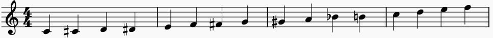
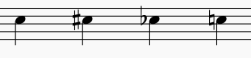

# MusicDoc

MusicDoc is a simple but powerful markup format for musical scores and partitures.
It is inspired by [ChordPro](https://www.chordpro.org/), [ABC notation](https://en.wikipedia.org/wiki/ABC_notation), and [AsciiDoc](https://asciidoc.org/).

The key principle of MusicDoc is simplicity!
Just write your lyrics and add some simple notation markup for chords, notes, bars, breaks, etc.

This makes MusicDoc different from musical formats such as [MusicXML](https://www.musicxml.com/).
Further, it extends [ChordPro](https://www.chordpro.org/) following the concept of _lyrics first_.
This makes it different from [ABC notation](https://en.wikipedia.org/wiki/ABC_notation) so if you (mainly) want to write instrumental music without lyrics you should prefer ABC instead of MusicDoc.

## Chords

With regular ChordPro you can simply annotate lyrics with chords like this:

```
A|l[Am]as my |l[C]ove you |d[G]o me |w[Em]rong to cast|
```

The result may be rendered as following:

```
 | Am    | C       | G    | Em          |
A|las my |love you |do me |wrong to cast|
```

The great benefit of this notation is its simplicity: 
You can wrap and break the line anywhere in the text whereas in the "rendered" text manual wrapping would be much more tedious.
Actually the format with chords on top of lyrics is used by [OpenSong format](http://www.opensong.org/home/getting-started) and has serious disadvantages compared to ChordPro.

## Staves

Now if we want to add a stave with the melody we can additionally annotate the notes in curly braces:

```
{A}A|{c2}l[Am]as {d}my |{e.}l[C]ov-e {f/2}yo-{e}u |{d2}d[G]o {B}me |{G.}w[Em]rong {A/2}to {B}cast|]
```

The result may be rendered as following:


## Note Pitch

Notes are annoated in curly braces. The pitch is specified as simple Ascii notation like in ABC:

```
C C# D D# E F F# G G# A Bb B c d e f
```



As you can see the notation is very easy to read and write.
Capitalized pitches are in octave 1 (`C = c1`) and lower casee pitches are in octave 2 (`c = c2`).
Please also note that you can use any obvious enharmonic change or alternative notation:

* `C#` can also be written as `Cis` (or `CIS`) and has enharmonic change like `Db` (`Des`)
* `B` can also be written as `B♮` or `H` (German notation) and has enharmonic change like `Cb` (`Ces`).

Please note that pitches are always written absolute and only the rendering decides about accidental signs according to the key of your stave.
Therefore `C#` will be rendered different from `Db` but writing `C#` does not say or enforce that a sharp sign is rendered in front of the note.
Music is complex and MusicDoc wants to make your life simple so you do not need to worry where to put accidental signs.
However, in case you need to enforce accidental signs, you can do so following ABC conventions:

```
c ^c _c =c
```



In the key of C-major you would get the same result as above just writing:

```
c c# cb c
```

In case you need higher or lower pitches you can easily do so:

* A single quote sign increases the octace (`c' = c3`, `c'' = c4`, etc.)
* A comma sign decreases the octave (`C, = c0`, `C,, = C-1`, etc.)

## Note Value

By default the value is a quarter note. By appending a number to the pitch you can multiply the value times this number.
Therefore appending a `2` gets a half note and appending a `4` gives a whole note (lasting 4 quarters).
In order to decrease the value you can devide the value by appending a slahs (`/`) followed by a number.
This will divide the value by the number. For convenience a `/2` can simply be written as `/` (omitting the `2`).
Therefore `/2` will by default give you an eighth note and `/4` a semiquaver note.

These two approaches can also be combined so `c3/2` will give you a pitch of `c` lasting three times of the half of a quarter note so technically it is a punctuated quarter note. Unlike in ABC notation you can also write `c.` for this in MusicDoc.
Also you can simply create tripplets so `c2/3 d2/3 e2/3` will give you a tripplet of the pitches `c d e` that each have the same value and last a half note in total.

## MusicDoc Library

In our [MusicDoc](https://github.com/MusicDoc/MusicDoc) repository you can find a library written in Java capable of reading (parsing) and writing an entire paritutre from MusicDoc to a structured Java object representation. It also allows complex musical operations such as proper transposing of the score.
Further you can also read other formats to import and convert to MusicDoc.

## MusicDocApp

In our [MusicDocApp](https://github.com/MusicDoc/MusicDocApp) repository you can find an android application based on the above library to organize and manage your entire collection of paritures in MusicDoc and play a song of your choice with auto-scrolling, optional midi sound and much more.
